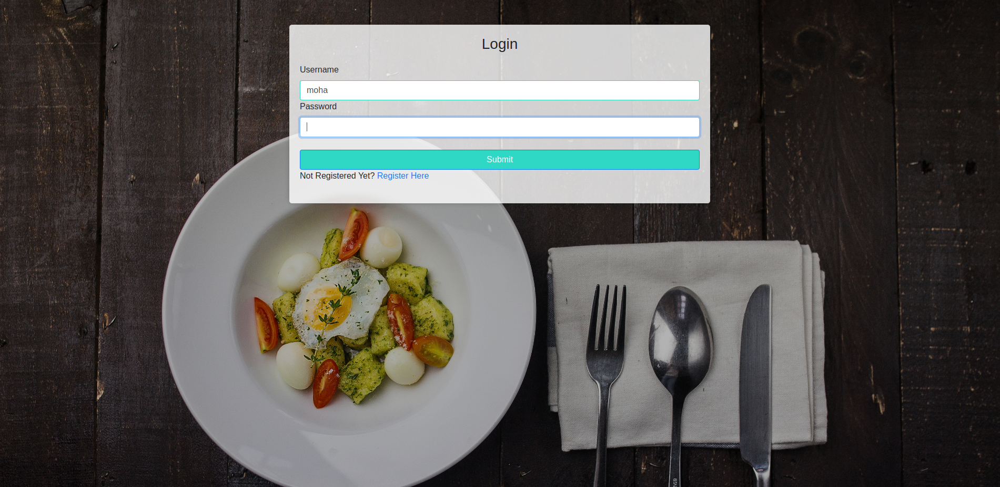
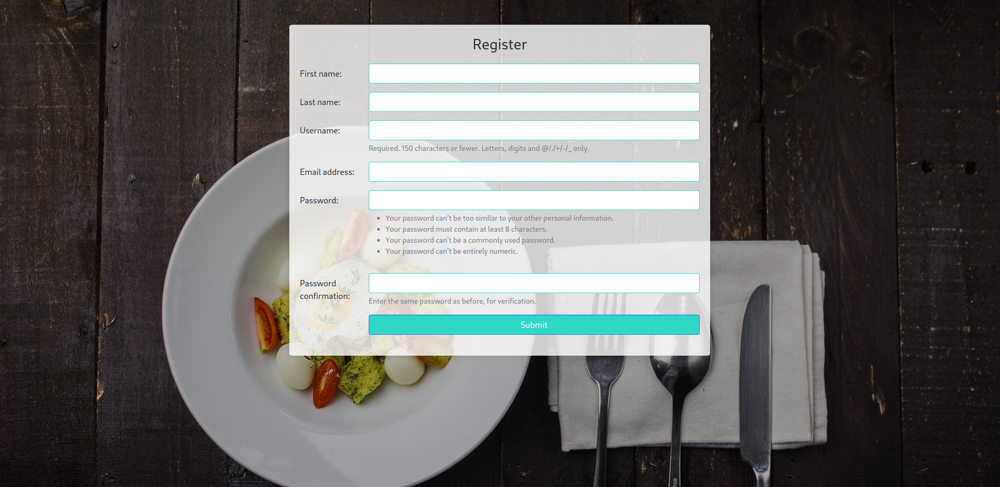

# RecipeBox
# 

RecipeBox is a web application built using Django REST framework (DRF) that allows users to share and discover recipes. It provides a platform for users to create, view, update, and delete recipes, as well as browse recipes shared by other users.

# 


## Table of Contents
* [Technologies](#technologies)
* [Features](#features)
* [Installation](#install)
* [Author](#author)

## <a name="features"></a>Features

- User Authentication: Users can register, login, and logout. Each user has their own profile page.
- Recipe Management: Users can create, view, update, and delete their own recipes. Each recipe includes details such as title, description, ingredients, instructions, and an optional image.
- Recipe Listing: Users can browse and search for recipes shared by other users. Recipes can be filtered by various criteria such as category, Name.
- 

## <a name="install"></a>Installation

1. Clone the repository:

   ```shell
   git clone https://github.com/moha-mame/RecipeBox.git


## <a name="technologies"></a>Technologies

Backend: Python, Django, MYsql<br/>
Frontend: JavaScript, jQuery, JSON, Jinja2, HTML5, CSS, Bootstrap<br/>
Libraries: mysqlclient, sqlparse, asgiref, Django


## <a name="author"></a>Author
[@Mohammed - Github](https://github.com/moha-mame) - [@Neima Nesru - Github](https://github.com/Nemuuuu)
